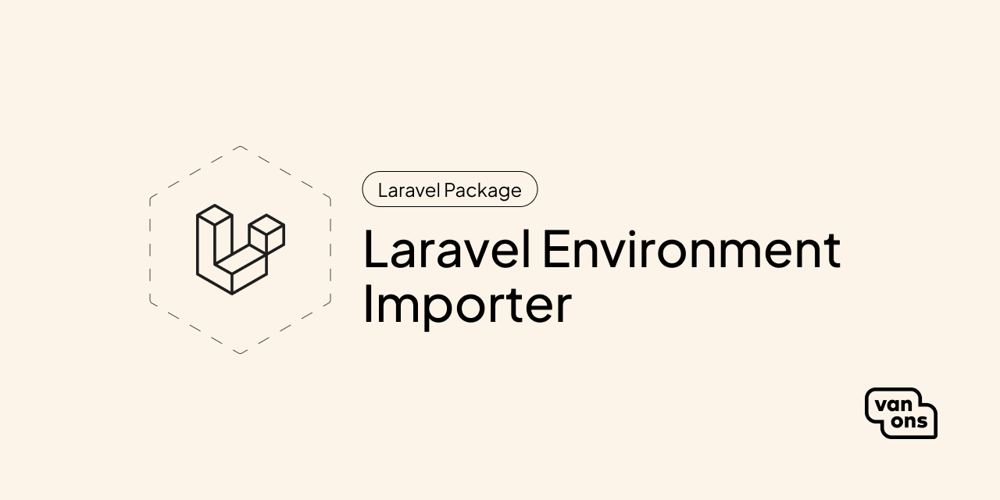

<p align="center"></p>

# Laravel Environment Importer

[](https://github.com/VanOns/laravel-environment-importer/releases)
[](https://packagist.org/packages/van-ons/laravel-environment-importer)
[](https://github.com/VanOns/laravel-environment-importer/issues)
[](https://github.com/VanOns/laravel-environment-importer/blob/main/LICENSE.md)

A Laravel package for easy importing of a configured environment.

## Quick start

### Requirements

| Dependency | Minimum version |
|------------|-----------------|
| PHP        | 8.0             |
| Laravel    | 10.0            |

### Installation

While the package is for internal use only, you can install it from GitHub. Add the following to your `composer.json`:

```json
{
    "repositories": [
        {
            "type": "vcs",
            "url": "https://github.com/VanOns/laravel-environment-importer"
        }
    ]
}
```

Then, install the package:

```bash
composer require van-ons/laravel-environment-importer
```

Next, publish the configuration file:

```bash
php artisan vendor:publish --tag="environment-importer-config"
```

Finally, open the configuration file (`config/environment-importer.php`) and adjust it to your needs.

### Usage

You can execute the import command by running:

```bash
php artisan environment:import
````

See [Basic usage](docs/basic-usage.md) for more information.

## Documentation

Please see the [documentation] for detailed information about installation and usage.

## Contributing

Please see [contributing] for more information about how you can contribute.

## Changelog

Please see [changelog] for more information about what has changed recently.

## Upgrading

Please see [upgrading] for more information about how to upgrade.

## Security

Please see [security] for more information about how we deal with security.

## Credits

We would like to thank the following contributors for their contributions to this project:

- [All Contributors][all-contributors]

## License

The scripts and documentation in this project are released under the [MIT License][license].

---

<p align="center"><a href="https://van-ons.nl/" target="_blank"></a></p>

[documentation]: docs/README.md
[contributing]: CONTRIBUTING.md
[changelog]: CHANGELOG.md
[upgrading]: UPGRADING.md
[security]: SECURITY.md
[email]: mailto:opensource@van-ons.nl
[all-contributors]: ../../contributors
[license]: LICENSE.md
