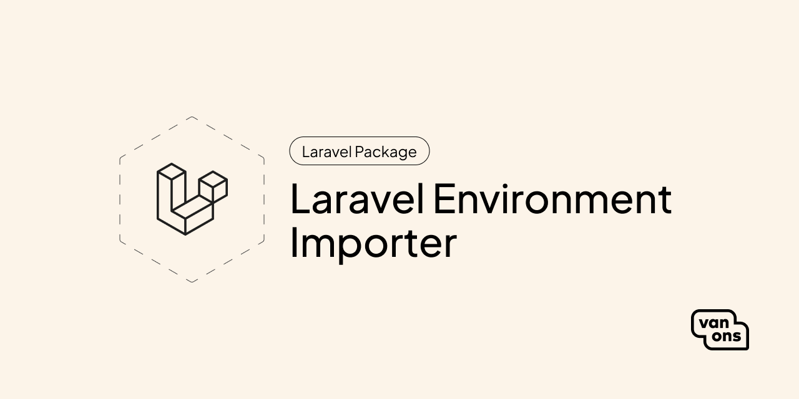

<p align="center"></p>

# Laravel Environment Importer

[](https://github.com/VanOns/laravel-environment-importer/actions/workflows/run-tests.yml)
[](https://github.com/VanOns/laravel-environment-importer/releases)
[](https://packagist.org/packages/van-ons/laravel-environment-importer)
[](https://github.com/VanOns/laravel-environment-importer/issues)
[](https://github.com/VanOns/laravel-environment-importer/blob/main/LICENSE.md)
[](https://plumbphp.dev/van-ons/laravel-environment-importer)

A Laravel package for easy importing of a configured environment.

## Quick start

### Installation

First, install the package via Composer:

```bash
composer require van-ons/laravel-environment-importer
```

Then, publish the configuration file:

```bash
php artisan vendor:publish --tag="environment-importer-config"
```

Next, open the configuration file (`config/environment-importer.php`) and adjust it to your needs.

### Usage

You can execute the import command by running:

```bash
php artisan environment:import
````

## Documentation

Please see the [documentation](docs/README.md) for detailed information about installation and usage.

## Contributing

Please see [Contributing](CONTRIBUTING.md) for more information about how you can contribute.

## Testing

```bash
composer test
```

## Changelog

Please see [Changelog](CHANGELOG.md) for more information about what has changed recently.

## Upgrading

Please see [Upgrading](UPGRADING.md) for more information about how to upgrade.

## Security

Please see [Security](SECURITY.md) for more information about how we deal with security.

## Credits

We would like to thank the following contributors for their contributions to this project:

- [All contributors](../../contributors)

## License

The scripts and documentation in this project are released under the [MIT License](LICENSE.md).

---

<p align="center"><a href="https://van-ons.nl/" target="_blank"></a></p>
